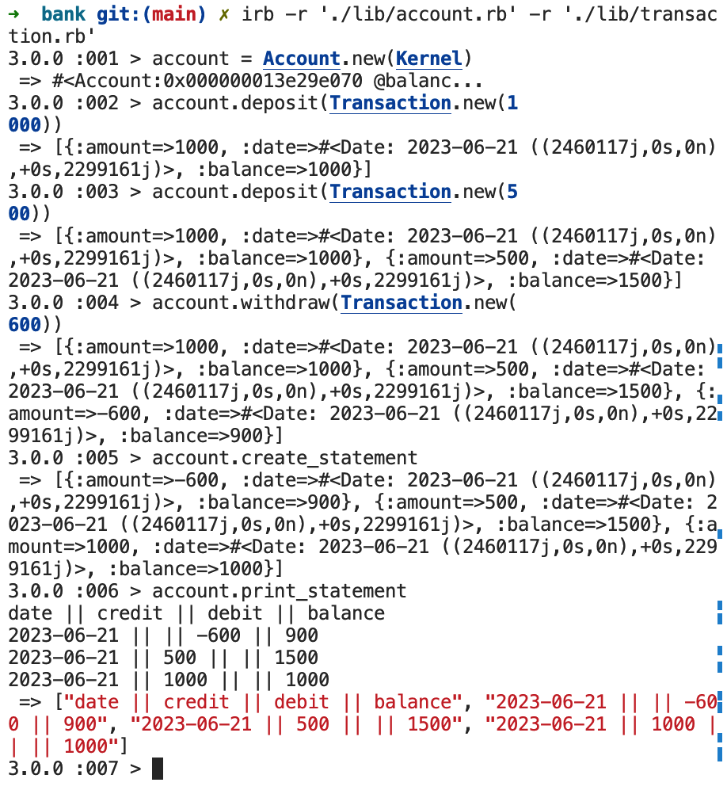

# bank-tech-test

## Approach

I took a OOD approach to building a bank account, I got the idea from when I made a diary with diary entries being injected into the parent class. This idea also seemed to work well with the parameters I was given. Although there were some struggles with initially with the design and I had to change it up, eventually I ended up with this aproach. My design approach was a notepad next to me with my thoughts scribbled on it.
It is difficult to follow so although it could be amusing to save you the headache I havent attached it but please find attached a screenshot of the program working within irb.

### Image of the program running



## Instructions

1. Clone the repository.
2. Run `bundle install` to install the dependencies.

### Instructions to run the tests

Once bundle install has run, run `rspec` in terminal

### Instruction to run the code

Once bundle install has run follow this guide

1. Run this within your terminal

```
irb -r './lib/account.rb' -r './lib/transaction.rb'
```
2. Run a new account with `account = Account.new(Kernel)`
3. To add a new transaction of type `deposit` run this within irb:
```
account.deposit(Transaction.new(1000))
```
4. To add a new transaction of type `withdraw` run this within irb:
```
account.withdraw(Transaction.new(1000))
```
5. To print the bank statement run this within irb:
```
account.create_statement
account.print_statement
```